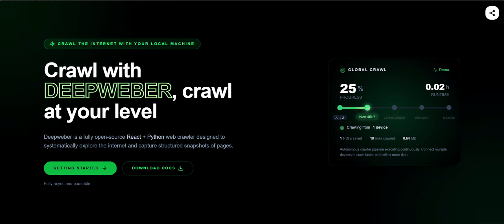
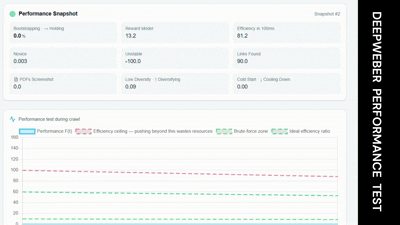

# DEEPWEBER – [](#status)  [](https://www.python.org/)  


**DEEPWEBER** is a lightweight, high-performance domain crawler designed to discover, verify, analyze and extract domains with minimal setup. It consolidates over 10000 lines of code  while maintaining modularity and reliability.

---

## 🚀 Quick Start

1. Install dependencies:  
```bash
pip install -r requirements.txt
```
2. Python main.py:  
```bash
python main.py
```
3. Open your browser at localhost 3000 or your IP:3000 a app based on react is generated to show progress
      - Data are saved to `./generation/visited` or `./generation/json`
4. Lunch pdf generation - PDF are saved to `./generation/pdf`
```bash
python viewpdf.py
```

## Efficient test

   
### Progress of DEEPWEBER
| Category         | Capability                             | Status |
| ---------------- | -------------------------------------- | ------ |
| **Crawling**     | A–Z domain sweep                       | ⏳      |
|                  | Subdomain discovery                    | ⏳      |
|                  | Bruteforce (dictionary + permutations) | ⏳      |
|                  | Recursive link crawling (depth‑aware)  | ⏳      |
|                  | sitemap.xml & robots.txt parsing       | ⏳      |
|                  | URL normalization & canonicalization   | ✅      |
| **Verification** | Streaming domain verification          | ⏳      |
|                  | HTTP status detection                  | ✅      |
|                  | SSL/TLS validation                     | ⏳      |
|                  | Parked / expired domain detection      | ✅      |
|                  | Redirect chain analysis                | ⏳      |
|                  | MIME / content‑type detection          | ⏳      |
| **Safety**       | Adaptive rate limiting                 | ✅      |
|                  | Request timeout handling               | ✅      |
|                  | Exponential backoff retries            | ⏳      |
|                  | Robots.txt strict & permissive modes   | ⏳      |
|                  | Trap / honeypot detection              | ⏳      |
|                  | Blacklist / whitelist rules            | ✅      |
| **Networking**   | Proxy support                          | ⏳      |
|                  | TOR routing mode                       | ⏳      |
|                  | Header randomization                   | ⏳      |
|                  | IP randomization                       | ⏳      |
| **Performance**  | Multi‑threaded crawling                | ⏳      |
|                  | Async I/O pipeline                     | ✅      |
|                  | Queue‑based scheduler                  | ✅      |
|                  | Resume from checkpoints                | ✅      |
|                  | Distributed crawling                   | ⏳      |
| **Storage**      | JSON output                            | ⏳      |
|                  | Compressed output                      | ⏳      |
|                  | SQLite backend                         | ⏳      |
|                  | Append‑only logs                       | ⏳      |
| **Analysis**     | Content hashing                        | ⏳      |
|                  | Duplicate detection                    | ⏳      |
|                  | Keyword extraction                     | ⏳      |
|                  | Language detection                     | ⏳      |
|                  | Page classification                    | ⏳      |
|                  | Server fingerprinting                  | ⏳      |
| **DevX**         | CLI interface                          | ⏳      |
|                  | Modular documentation                  | ⬜      |

✅ Implemented   ⬜ Planned ⏳ Made but not published
---
🔍 Features in Progress

Remote multi-server IP rotation with configurable intervals only local network works for now

Seperation of python to multiple so it fits the limit of 1000 lines at mat in one file

Implement OS directly for IP insted of web sockets

🛠️ Next Steps not started yet

Fine-tuning phase 1

Basic next-word prediction from collected data

Fine-tuning phase 2

---
**Version:** 1.0.2 | **Python:** 3.8+ | **Updated:** 07 FEB 2026
